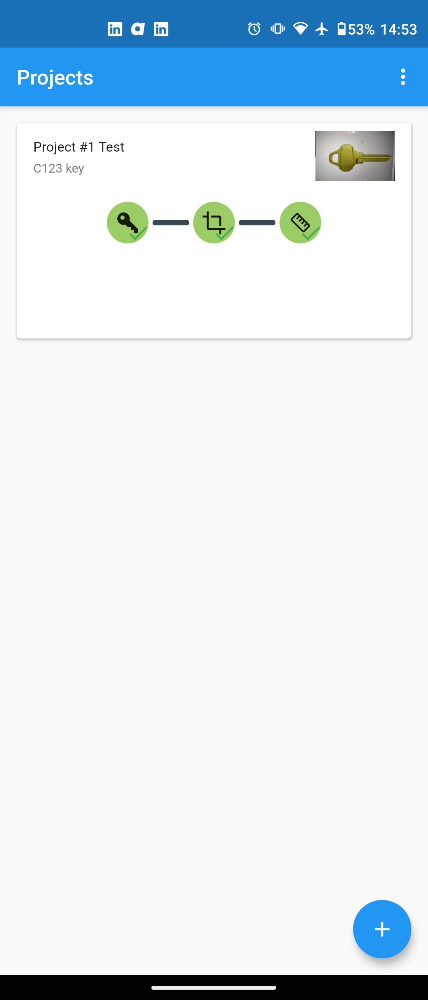
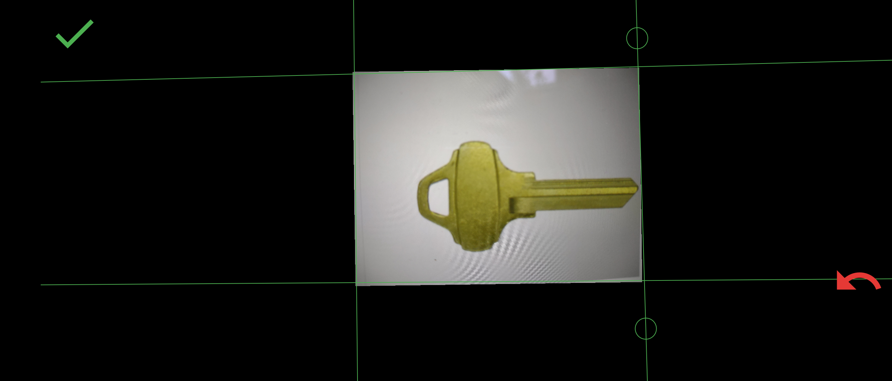
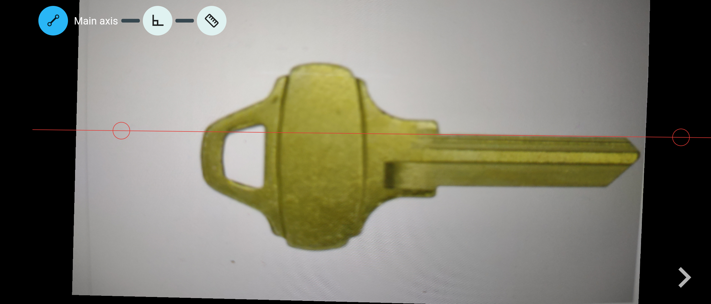
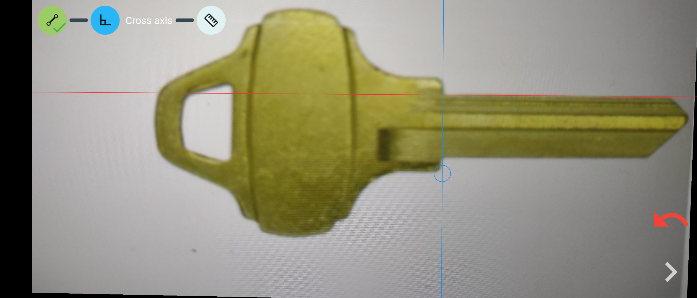
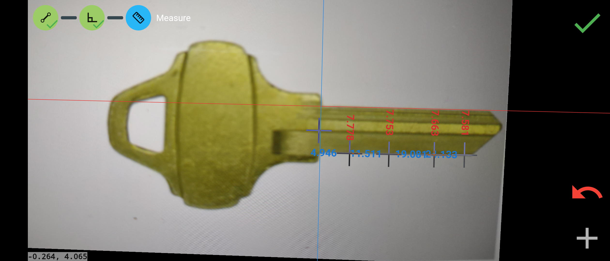
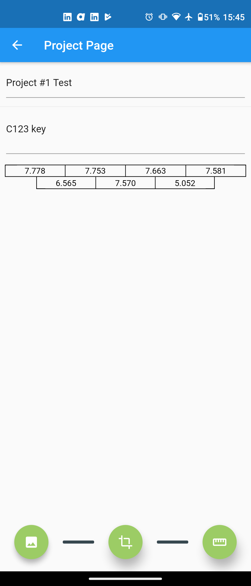

# Summary

<!--ts-->
   * [KeyDecoder](#keydecoder)
   * [Summary](#summary)
   * [Disclamer](#disclamer)
   * [Installation](#installation)
      * [Build](#build)
        * [Android](#android)
        * [IOS](#ios)
      * [Releases](#releases)
   * [Usage](#usage)
      * [Take Picture](#take-picture)
      * [Cropping](#cropping)
      * [Back line](#back-line)
      * [Shoulder line](#shoulder-line)
      * [Measurements](#measurements)
   * [FAQ](#faq)
   * [License](#license)
<!--te-->

# Disclamer

## Making keys without consent is illegal.

This Key Decoding application is only meant for legal use. If you have unlawful intentions, you're are not allowed to use this application.
To limit the risk of illegal use, an ISO sized card is necessary to decode a mechanical key, and the key must be taken off from its keyring.
We will provide no help nor assistance to any user that we believe is willing to commit a crime or a felony. 

## Educational and Consulting use only.

This Key Decoding app is meant to be used by Pentesters during their audits, to explain to their clients how easily a criminal can duplicate keys (from picture, by molding, or simply by asking a local locksmith to make a duplicate). Fair use is allowed if used by security enthusiasts, to assess their own security, and discover the difficulty of making keys only using a picture. 
The authors DO NOT ALLOW any users to sell keys created with the help of this app. Rulebreakers are subject to lawsuit.

## Security advice.

If you want to protect yourself from having your keys duplicated without your consent (with a picture, or by molding, or more simply by someone asking a locksmith to make a copy), you are invited to apply the same best practices to your keys as you do with your Credit Card or your Password. Just like credit cards and passwords, you must not lend your keys, or leave them unattended.

<p align="center" style="font-size:30px">
<strong>Have Fun, Stay Legal, Hide your keys.</strong>
</p>

*****

# Installation

[](https://play.google.com/store/apps/details?id=com.keydecoder)

## Build

* Download [Flutter SDK](https://flutter.dev/docs/get-started/install)

### Android

* Download [OpenCV v4.3.0](https://sourceforge.net/projects/opencvlibrary/) 
* Create the `local.properties` file under `android/`, providing the following settings :
```sdk.dir=<Android SDK path>
flutter.sdk=<Flutter SDK path>
flutter.buildMode=release
flutter.versionName=1.0.0
flutter.versionCode=1
opencv.sdk=<OpenCV Android SDK path>
```
* Build the project using `flutter build apk`

### IOS

*IOS is not currently supported*

## Releases

The most recent builds can be found in the [Play Store](https://play.google.com/store).

# Usage

## Overall

Below is the overall project view of decoding the Schlage C123.
<p align="center">
 
</p>

# Steps to achieve this

## 1. Take Picture

Take a picture of a key, removed from its key ring, and place in the middle of an ISO/CEI 7810 ID-1 sized card (credit card, business card...). 


## 2. Cropping

Use the green lines to crop the image to only retain the card.
You can zoom to be more precise.

<p align="center">
 
</p>

## 3. Back line

Align the red line to match the back of the key.

<p align="center">
 
</p>

## 4. Shoulder line

Align the blue line to the shoulder of the key.

<p align="center">
 
</p>

## 5. Measurements

Now, you can place points in the middle of each cuts of your key.
Once done, you can validate and retrieve your measures on your project's page.

<p align="center">
 
</p>

## 6. Information

After scanning, the key information is visitble.

<p align="center">
 
</p>


## Reference

https://github.com/MaximeBeasse/KeyDecoder/tree/master
